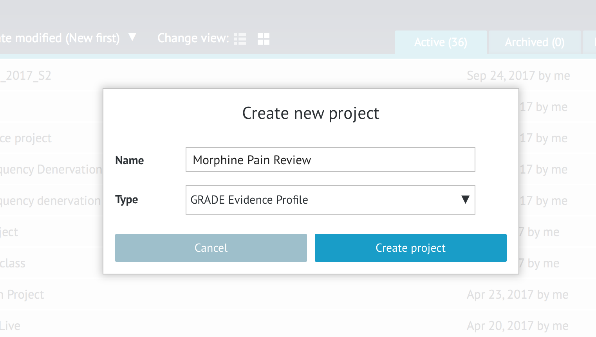
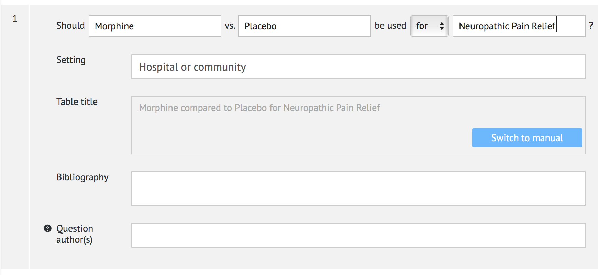
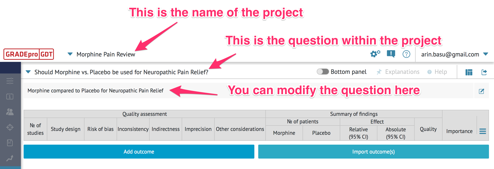
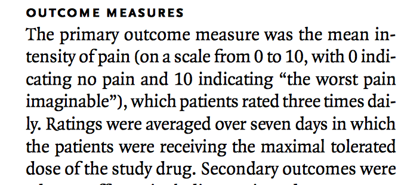
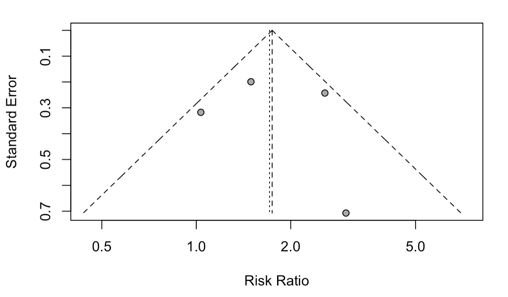

## What is a meta analysis?

Meta analysis refers to a process of combining the results of primary studies to arrive at a pooled estimate of the that estimate. For example, let's say you are interested to study if a particular drug X is effective in the treatment of high blood pressure. For this, you can either review the results of a single trial (a randomised controlled trial), or you can pool the results of more than one randomised controlled trial for similar patients and arrive at a summary estimate of the effect as to whether the drug X is beneficial for high blood pressure; also, based on the subset of studies, you can find out if the harms associated with the drug X is large enough when the resuls of the studies are pooled. In this context, I wrote about an intervention and effect of that intervention on an outcome, but you can also consider effect of an exposure (as happens in observational epidemiological studies); in this way, you can conduct a meta analysis of any number (as long as that number is two or more) of cohort or case control studies to test the association between an exposure and an outcome variable. For example, if you want to study the effect of smoking on heart disease, you can conduct a meta analysis to test the effect estimate of smoking on heart disease by pooling together results of case control studies on the association between smoking and heart disease.

In this part (part I), we are going to learn how we can use GRADE and R to conduct a meta analysis. In the next part, we will introduce GRADE and GRADEPro software for conducting an evidence appraisal in another way. R is a free and open source software you can use for statistical programming and statistical data analysis. In this part, we are only going to use a small set of functions with R. You will not need to know the nitty gritty of working with R in order to work through this module (although I recommend that you study that); you can work through the codes by selecting and running them in the RStudio server instance we have set up for you. We will conduct a meta analysis and we will use GRADE approach and GRADEPro software to learn how you can approach quality assessment of studies using GRADE (just the principles and some applications). How to use GRADE will be taken up in the next module. GRADE is a short hand for grading, recommendations, appraisal, development and evaluation of guidelines. While it is used for guideline (clinical and public health practice) guidelines development, you can also use GRADE for other purposes. Meta analysis is based on appraisal of individual studies, GRADE is used for appraisal of quality of individual outcomes. You can use meta analysis within a GRADE process.

## A brief summary of the Evidence appraisal

We have learned that evidence based practice consists of a series of steps where we identify a problem, we set up a series of questions (one or more questions), we search for relevant evidence, we appraise that evidence for possible biases in the research, and we identify the results of the studies. We have also learned that in evidence based healthcare, if we say that X causes Y (that is, if X as an intervention can cause Y a health outcome, or if Y a health outcome is causally associated with X an exposure), then X must satisfy the following nine criteria (not all of them, but at least the first four criteria of the following):

First, we must rule out any play of chance in the association between X and Y. We ensure in a study setting by selecting a proper sample size and sufficient power;
Second, we must make sure that the study or studies we are reviewing will have little bias; if the study has significant biases either in the allocation of exposure or intervention or observation of effects, then this bias will significantly compromise with the internal validity of such a study/studies
Third, we must make sure that all possible confounding variables have been taken care of, or as many possible confounding variables as possible were taken care of; otherwise, this too, is a factor that will interfere with the internal validity of the study. Normally, confounding is taken care of either in the design of the study (randomisation by design take care of observed and unobserved confounders; matching in case control studies take care of this only for those variables that are thought to be confounders ), or in the analysis phase where researchers use multivariate analyses;
Fourth, if X is to ba cause of Y, then X must precede Y in time sequence, so X must come first and then Y.
Other than these restrictions, in 1965, Sir Austin Bradford Hill discussed nine considerations that included the time sequence and these are used to ascertain if the nature is one of cause and effect (cite Hill).
We also know that in a hierarchy of evidence in terms of what study design is best suited for framing high quality evidence and what study design is considered to be not so high quality of evidence, we have almost a ladder of study designs. At the top of that hierarchy we have meta analyses of randomised controlled trials, and at the bottom rung of that ladder, we have case studies and case series. We have learned that RCTs are high quality study designs because they take care of selection bias and confounders, and when blinded (the more blinding the better), they are excellent study designs to take care of most biases and all confounding variables. Besides, if the RCTs are large in size (with many individuals enrolled), then these are good study designs to bank on.

In meta analyses, we will pool the results of similar RCTS for studying the health effects of specific interventions. For this exercise, we have selected the following problem.

## Problem we will study:

Neuropathic pain is caused due to damaged nerves and the type of pain is usually treated with opioids. Morphine is an opioid that is used to treat neuropathic pain. What is the effectiveness of morphine in treating neuropathic pain in adults in pain relief and how safe is it?

## Steps of meta analysis and use of GRADE

We will use GRADE and RStudio simultaneously for this exercise. Our meta analysis exercise will consist of the following 10 steps:

1. We will frame a PICO formatted question
2. We will then search for studies on Pubmed
3. We will select and reject studies based on our specified selection and rejection criteria
4. We will work on the basis of full text studies to abstract information
5. We will pool together the results of the studies
6. We will appraise the quality of these studies and assign them grades
7. We will test if we have missed studies that are small and have equivocal results
8. We will test for subsets of studies & we will test if the studies are sufficiently similar

## Step 1: Frame a PICO formatted question

From the above problem, we set up the following PICO formatted question:

"Among adults with neuropathic pain, what is the effectiveness of morphine compared with placebo in relieving pain to the extent of at least 30% from baseline and little adverse effects?"

The PICO are as follows:

"P": "Adults with neuropathic pain"
"I": "Morphine"
"C": "Placebo or other treatments"
"O": 30% or more pain relief, or patient reported substantial change (patient global impression of change or PGIC)

This question will help us to set up selection/rejection criteria and terms for our search of litearature databases:

## Selection Criteria

- Age group 18 years and above
- Patients must suffer from neuropathic pain
- Morphine must be the intervention
- Pain relief as the outcome
- Randomised controlled trials
- Peer reviewed English language publications
- We will not restrict dates for our search

## Search terms and algorithm
We will use the following search algorithm on Medline/Pubmed. Open Pubmed webpage and view the page that should look as follows:


We will reproduce the following search strategy there to get started: (download the following text and type the search terms in the pubmed box)
If you followed the search terms in the table and typed them in Pubmed, you will end up with 3 articles.
This was reproduced from another Cochrane Meta-analysis and they searched different other databases, so we will not go into the details of those searches. The [Cochrane review is linked here](http://onlinelibrary.wiley.com/doi/10.1002/14651858.CD011669.pub2/full) and you can go over the trial details.

Based on the search terms and selection process, the authors identified five studies. These studies are:

Gilron I, Bailey JM, Dongsheng T, Holden RR, Weaver DF, Houlden RL. Morphine, gabapentin, or their combination for neuropathic pain. New England Journal of Medicine 2005;352(13):1324-34
[DOI: 10.1056/NEJMoa042580]

Gilron I, Tu D, Holden RR, Jackson AC, DuMerton-Shore D. Combination of morphine with nortriptyline for neuropathic pain. Pain 2015;156(8):1440-8.
[DOI: 10.1097/j.pain.0000000000000149]

Huse E, Larbig W, Flor H, Birbaumer N. The effect of opioids on phantom limb pain and cortical reorganization. Pain 2001;90(1-2):47-55.
[DOI: 10.1016/S0304-3959(00)00385-7]

Khoromi S, Cui L, Nackers L, Max MB. Morphine, nortriptyline and their combination vs. placebo in patients with chronic lumbar root pain. Pain 2007;130(1-2):66-75
[DOI: 10.1016/j.pain.2006.10.029]

Wu CL, Agarwal S, Tella PK, Klick B, Clark MR, Haythornthwaite JA, et al. Morphine versus mexiletine for treatment of postamputation pain. Anesthesiology 2008;109(2):289-96.
[DOI: 10.1097/ALN.0b013e31817f4523]

We will now use GRADEpro software to fill in the data from each of these articles and will learn how GRADE can be used to construct evidence. However, it is important to note that GRADE approach uses outcomes as units of analysis rather than individual studies as units of analysis as we do in meta analyses.

## How to use GRADEpro?

The first step is to visit the GRADEpro website and register yourself:

After you log in, click on "New project", when you do so, it will look like as follows:



Fill in as shown in this figure and select GRADE Evidence Profile from the drop down box. Then click "Create Project"; you can do different things in the GRADEpro, and a full description of everything that is possible in GRADE pro is out of the scope of this class or tutorial. Instead, now focus on three boxes displayed. Click on "Add management question" because we are interested in finding out the effectiveness of morphine for pain relief. This will open a screen as follows and fill in the relevant boxes. When you do so, the screen should look like as follows:


You do not have to fill in the bibliography or the question authors at this stage. You have only one problem statement and one question here. So, if you click on the problem statement on the top of this box, this will open the following window for you:



Click on "Add outcome" to proceed. We are going to use one study (Gilron I, Bailey JM, Dongsheng T, Holden RR, Weaver DF, Houlden RL. Morphine, gabapentin, or their combination for neuropathic pain. New England Journal of Medicine 2005;352(13):1324-34
[DOI: 10.1056/NEJMoa042580]) to fill in the details. You can do the other studies yourself. GRADE approach is about outcomes, not individual studies, so the purpose of this exercise is to show you how you can fill in the details. In future, we will see how we can fill in the details from multiple studies. So, after you click, add outcome and abstract information from the Gilron study, the page will look like as follows:


This is the first thing you do, that is, fill in the information about outcome measurement and give the outcome a name. Where in the article do we find out the information? You find that information in the section named "outcome measurement". If your article does not contain that information, look for it. For example, in this article, the information was contained in the following section:



Now, click on the "save" icon and this will take you to the screen where you will fill in the boxes. We will describe the processes, step by step:

| Title of the Box | What to fill in and why?    |
|------------------|-----------------------------|
| Number of studies| Here, one, otherwise ...    |
| Study design     | Randomized Trial (1)        |
| Risk of Bias     | Not Serious (2)             |
| Inconsistency    | Not Serious (3)             |
| Indirectness     | Not Serious (4)             |

Explanations:
1. In this case, the study was randomized trial. If you have some studies that are randomized trials and other studies are observational studies, then you should group together these studies and select from the choice according to that plan.
2. Risk of Bias is not serious and you can find out by reading the methods section. Here, it was a double blind trial, there was no way the patient would find out if he or she was receiving the intervention or the placebo, and the pharmacist would not know either, and a randomized controlled trial would otherwise be free from selection bias. Hence we say that the risk of bias is not serious. For other study designs, read the methods section of the article very carefully and then decide.
3. The inconsistency in this case is not serious because this is just one study, so we have only one set of findings. If you deal with more than one study, we will need to look into "heterogeneity" (see the section below) and if we find that there are considerable variation in the study findings, then we shall select serious, or very serious. What is serious versus what is very serious is debatable. If you find that the results are all over the place, then, you can label it as very serious; on the other hand, if the results look similar but too similar, then think of a serious inconsistency. If the results are not statistically heterogeneous, then this is not a problem. Also, for single studies, you do not talk about inconsistency.
4. Indirectness refers to how the outcome was measured. If the outcome is measured using surrogate measures or some biological variables not directly related to the outcome, then it is a problem. In this case, the patients themselves recorded their pain score, hence this is not a serious issue.

Now we turn to the results section of the paper and fill in the remaining bits.

| Condition   | What decision     |
|-------------|-------------------|
| Imprecision | Not serious (1)   |
| Other considerations | None (2)     |

1. When you look for imprecision, look for if the authors have reported p-values and 95% confidence intervals. If the p-value is less than 0.05, or if the 95% confidence interval range does not include the null value within it, then you know that the results are not imprecise. The null value for a difference will be "0", and null value for Odds Ratio or Relative Risk will be "1". Hence, all of the following will be imprecise:

1. A p-value of 0.20
2. An Odds Ratio of 1.5 (95% CI: 0.7-2.3)
3. A Relative Risk of 2.3 (95% CI: 0.8-3.5)

Now we move to the next part of the GRADEPro decision making:

- Number of patients in the "Morphine" Arm
- Number of patients in the "Placebo" Arm
- Effect Size (they have reported absolute effect but we do not know the 95% CI)

There are two other columns, Quality and Importance will need to be worked out. GRADEpro automatically estimates the quality of either one study or the body of evidence; the importance is determined by you.

How many people were in the "Morphine" arm. We estimate that using the figures from the article below:

```{r how_many}
screening <- 86
excluded <- 29
withdrew <- 16
participated <- screening - (excluded + withdrew)
(participated)
```
Because these individuals received sequences of intervention and placebo, the intervention and the placebo arm were both based on 41 individuals. For the effect size where we are only going to compare 0-10 point pain scale, we see in the results section,

"Mean pain intensity on a scale from 0-10 at baseline and at the maximum tolerated dose was calcuated as follows: mean(+/- SE) at baseline, 5.72 +/- 0.23, with placebo 4.15 +/- 0.33 with Morphine" but a clear standard deviation is not available. Hence, the effect size:

```{r effect_size}
baseline <- 5.72
final <- 4.15
effect_size <- final - baseline
(effect_size)
```

So, we see there is a "reduction" of 1.57 points on the pain scale; this should be entered in the boxes. Finally, we decide how critical is this outcome for our decision making. We decide that this was "critical". Hence, at the end of this exercise, our single study GRADE will look like as follows:


Now, let's learn how to conduct meta analysis in binary outcomes. We will abstract data from the meta analysis as shown here:


The authors of the meta analysis provide data for four studies: Gilron (2005), Huse(2001), Khoromi(2007), and Wu(2008). In each case the outcome was relief of pain 30% or more. Either the patients included in the study experienced such an improvement or they didn't hence this is a binary outcome. Here is a table

[Data set](binarydata.csv)

```{r read_data}
mydata <- read.csv("binarydata.csv") # read the data for meta analysis
mydata$mor_ne <- mydata$morphine_total - mydata$morphine_event # we create variables for non-event for morphine group
mydata$pl_ne <- mydata$placebo_total - mydata$placebo_event # we create variables for non-event for placebo group
```
The above codes help us to create the data sets that we will use for the binary meta analysis from the data we already have. Next, using R, we install and load the "meta" package of R. A package contains functions and data. See:

```{r load_pack}
# install.packages("meta"dep = T,)
library("meta")
```

Now, we will use the "meta" package in R to conduct the meta analysis

```{r conduct_ma}
mymeta <- metabin(event.e = morphine_event,
                  n.e = morphine_total,
                  event.c = placebo_event,
                  n.c = placebo_total,
                  data = mydata,
                  method = "MH") # Explain the codes
summary(mymeta) # summary of the meta analysis
forest.meta(mymeta) # draw the forest plot
funnel.meta(mymeta) # draw the funnel plot
```

This produces a meta analysis. First understand the output:


Then, the forest plot:


Finally to test the publication bias the funnel plot


